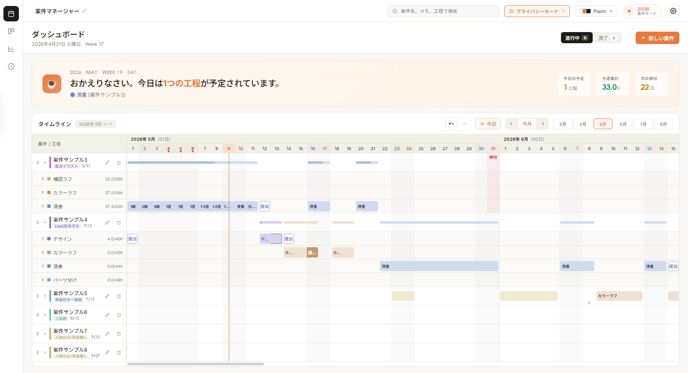
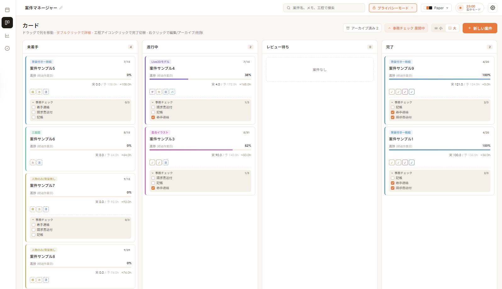

# scheduler

フリーランス向けの案件スケジュール管理アプリ。
水平ガントチャートで日付ごとに作業セルを色塗りし、進捗・締切・実績時間をひとつのウィンドウで管理します。





> イラストレーターが自分用に作成したスケジュール管理アプリです。ご自由にお使いください。
> 個人利用 / ソースコードの閲覧は OK、再配布や販売はご遠慮ください（[ライセンス](#ライセンス--利用条件) を参照）。

> **動作環境について**
> Windows 11 でのみ動作確認しています。Mac / Linux は未検証です。
> タブレット・スマートフォンには対応していません（PC ブラウザ・PC アプリ専用）。

> **開発について**
> 本アプリのコード実装には AI コーディングアシスタント（Anthropic の Claude Code）を活用しています。
> アプリ自体に画像生成 AI や生成 AI 機能は含まれていません。アプリアイコンは作者が作成しています。

---

## 特徴: 実績の自動記録 → 蓄積 → 作業量の可視化

ポモドーロタイマーで作業を計測すると、その時間が **今日の作業記録** と **工程の実績時間** に自動入力されます。データが蓄積されると **案件タイプごとの工程平均作業時間** が自動で算出され、作業量が可視化されます。
どこに時間がかかっているか自己分析したり、新規案件見積もりの参考にすることができます。

[スクリーンショット 7: ポモドーロタイマー — placeholder]

1. **計測**: 案件の工程を選んでポモドーロタイマーを開始
2. **自動記録**: タイマー完了時に今日の作業時間 / 工程の実績時間に自動で加算（手入力も可能）
3. **蓄積で見える化**: 完了案件が増えるほど、案件タイプ別の工程平均時間が精度を増す
4. **次案件の見積もりに活用**: レポート画面で「このタイプは平均N時間」が一目で分かる

[スクリーンショット 8: レポート画面（案件タイプ別 工程平均作業時間） — placeholder]

---

## ブラウザで試す

インストール不要。サンプル案件入りで起動するので、まず触感を確かめたい方はこちらからお試しください。

🌐 **<https://obbspl330-cell.github.io/scheduler/>**

データはお使いのブラウザの localStorage に保存されます（同じブラウザ・同じドメインの中だけで保持）。
試した内容を消したいときは `設定 → データ管理 → 全データをリセット`。

---

## デスクトップアプリとして使う

毎日使うなら Windows デスクトップアプリとしてインストールするのが快適です。

### インストール手順

1. このリポジトリの上部メニューにある **Releases** をクリック（または [こちら](https://github.com/obbspl330-cell/scheduler/releases) から）
2. 最新版の `scheduler Setup x.x.x.exe` をダウンロード
3. ダウンロードしたファイルをダブルクリックで実行

[スクリーンショット 3: Releases ページの場所 — placeholder]

[スクリーンショット 4: ダウンロードしたインストーラー — placeholder]

### Windows のセキュリティ警告について

インストール時に **「Windows によって PC が保護されました」** という青い画面が表示されます。

[スクリーンショット 5: SmartScreen 警告 — placeholder]

これはウイルス検出ではなく、Microsoft の署名証明書（年間数万円）を購入していない個人開発アプリ全般に表示される Windows 標準の警告です。

**進めるには:**

1. 青い画面の **「詳細情報」** をクリック
2. 出てきた **「実行」** ボタンをクリック

[スクリーンショット 6: 「詳細情報」→「実行」の手順 — placeholder]

不安な場合は:

- ソースコードは本リポジトリで全公開しているので、技術が分かる方に内容を確認してもらえます
- インストールせず、上記のブラウザ版で利用することも可能です

---

## 主な機能

### スケジュール管理
- 水平ガントチャート（タイムライン）
- ドラッグで作業日を移動・伸縮
- 工程ごとに複数の提出日を設定可能
- 案件タイプ別の工程テンプレート

### カードビュー
- 4 列カンバン（未着手 / 進行中 / レビュー待ち / 完了）+ 保留 / アーカイブ
- カードに事務チェックリストを内包

### 集中サポート
- ポモドーロタイマー
- 作業時間の自動ログ記録（タイマー完了時に工程の実績時間へ加算）
- 働きすぎを検知して休息を提案

### レポート
- 期間別（月 / 年 / 累計）の集計
- 工程別累計 / 案件タイプ別配分（ドーナツ）
- 期間内に完了した案件一覧

### カスタマイズ
- テーマ（paper / mint / lavender / ink / sakura + 自作テーマ）
- 案件タイプ・工程の色相を個別 + 全体の彩度・明度を一括調整
- 平日 / 休日の作業時間設定
- グリーティングアイコン: 任意の画像をアップロード → トリミング（位置・サイズ調整）→ 背景色（アクセント / 白）を選んで保存。アイコンのダブルクリックでも編集できます

### データ管理
- JSON エクスポート / インポート
- 画面共有用 **プライバシーモード**（案件名を「案件サンプル N」に置換）

---

## データの保存先とバックアップ

| 環境 | 保存先 |
|------|--------|
| ブラウザ版 | お使いのブラウザの localStorage |
| デスクトップ版 | `%APPDATA%\scheduler\v5-store.json` |

重要なデータは定期的に `設定 → データ管理 → JSON をダウンロード` でバックアップしてください。
ブラウザのキャッシュをクリアするとデータが消えます。

---

## FAQ

- **データを複数デバイスで同期できますか？**
  できません。各デバイス・各ブラウザのローカルに保存されます。引っ越したい時はエクスポート → 別デバイスでインポートしてください。

- **動作がおかしい / データが壊れたかも**
  まず `設定 → データ管理` から JSON をエクスポートして退避してください。それから「全データをリセット」で直る場合があります。

- **Mac / Linux / スマホ / タブレット で使えますか？**
  Windows でのみ動作確認しています。Mac / Linux はインストーラー未提供ですが、本リポジトリを `git clone` して `npm start` すれば動作する可能性があります（未検証）。スマホ・タブレットは UI が破綻するため非対応です。

- **商用利用したい / カスタムしたい**
  [ライセンス / 利用条件](#ライセンス--利用条件) をご確認の上、Issues でご相談ください。

---

## 開発者向け情報

### ブラウザで直接動かす

```bash
git clone https://github.com/obbspl330-cell/scheduler.git
cd scheduler-electron
# src/index.html をブラウザで開くだけで動きます
```

ビルド不要（Babel standalone でブラウザ内トランスパイル）。

### Electron 版を起動

```bash
npm install
npm start
```

### Windows インストーラーをビルド

```bash
npm run build:win
# 出力: dist/scheduler Setup x.x.x.exe
```

### 技術スタック

- React 18 + JSX（Babel standalone、バンドル無し）
- Electron（Windows デスクトップ）
- localStorage + Electron 側で `userData/v5-store.json` に同期書き出し
- 外部 API への通信なし（完全にローカル動作）

### ディレクトリ構成

```
scheduler-electron/
├── main.js                Electron メインプロセス
├── preload.js             contextBridge (IPC)
├── package.json           依存・ビルド設定
├── src/
│   ├── index.html         エントリ HTML
│   ├── electron-bridge.js Electron 専用ブリッジ
│   ├── react*.min.js      React 18 + Babel standalone
│   └── components/        画面別の JSX 群
└── assets/                アイコン・効果音
```

---

## ライセンス / 利用条件

このプロジェクトは **「ソース閲覧 / 個人利用 OK・再配布や販売は不可」** で公開しています。

**できること**

- ソースコードを閲覧する
- 自分の端末で動かす / 自分用に改変する
- 公開デモを利用する

**できないこと**

- 本リポジトリのソース・成果物を **そのまま再配布** する
- 本ソフトウェアを **販売・有償提供** する（改変版を含む）
- **クライアントへの再販売** や **SaaS としての提供**

商用ライセンスや個別の許可については Issues でご相談ください。

---

## クレジット

- 効果音 (`assets/alart*.mp3`): フリー素材
- フォント: Inter / Noto Sans JP / JetBrains Mono (Google Fonts)
